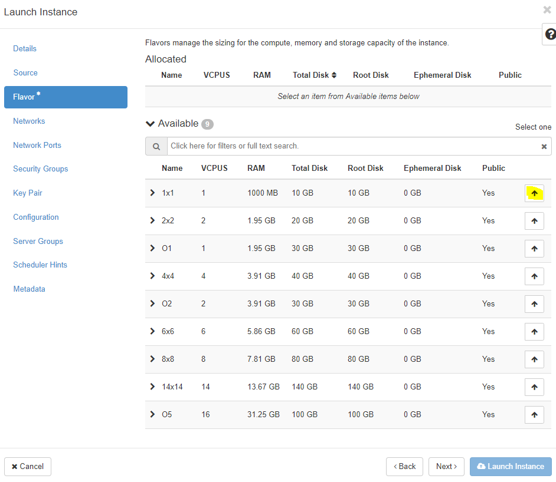
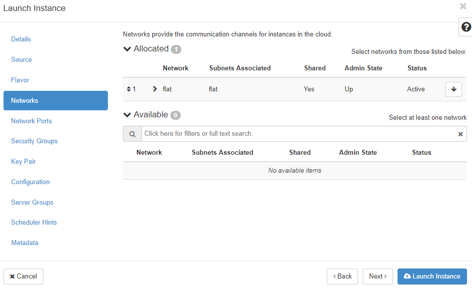
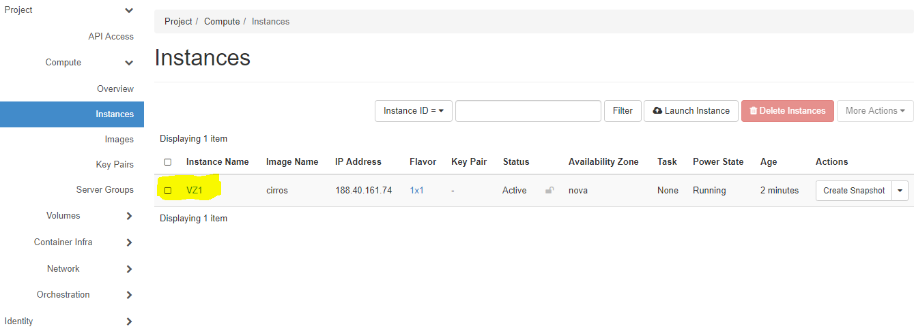
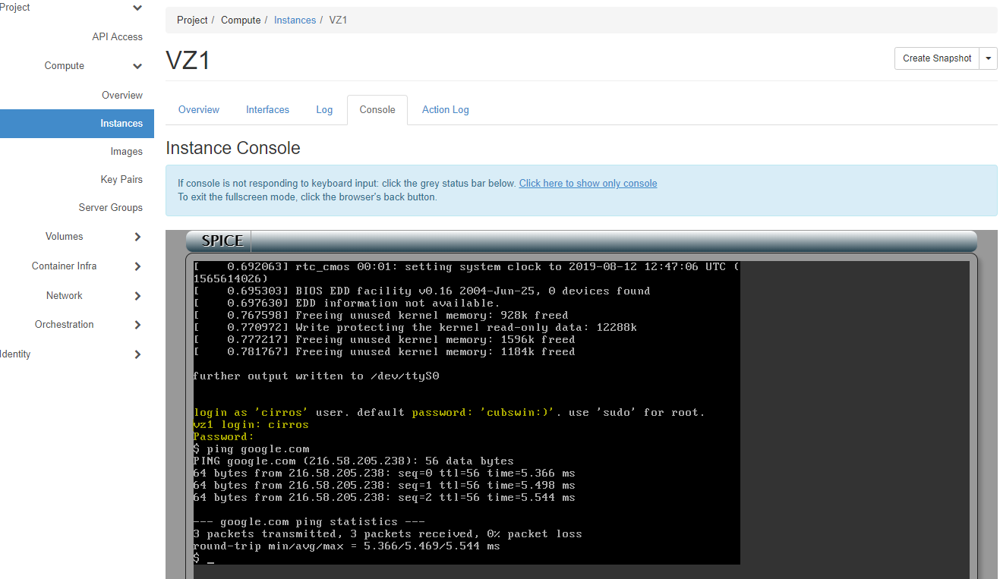

# Creating a new Linux VM
{: .no_toc }



<!-- ## Table of contents
{: .no_toc .text-delta }
s
1. TOC
{:toc} -->

### Go to Computer -> Instances -> Click "Launch Instance"

### Fill the main options, which are marked whith "*" and other you need

### Insert the name of the Instance (eg. "VZ1") and click Next Button

### Select Instance Boot Source (eg. Image), declare Volume Size (GB) and choose desired image (eg. cirros (12.67 MB) by clicking on arrow.

### Choose "Flavour" (eg. 1x1)

### Click "Networking" and then choose desired networks

### Open "Security Groups", after that, choose "default" 

### Launch your Instance by clicking on a "Launch Instance"

### You will see "Instances" menu whith your newly created VM

### Open the drop-down menu and choose "Console"

### Click on the black terminal area (to activate access to the console). 
	
### Enter login and password. 

### Now you can type commands.
	
### After you finish, type "exit"

