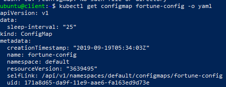
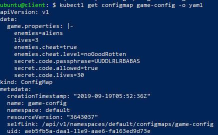
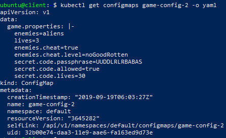

# ConfigMaps
{: .no_toc }
---

 
 


## Table of contents
{: .no_toc .text-delta }

1. TOC
{:toc}

## What is the ConfigMap 

**ConfigMap** - is configuration options for separate objects. ConfigMap contains key/value pairs with the values ranging from short literals to full config files.


## Create a ConfigMap

1) Use the `kubectl create configmap` command to create configmaps from directories, files, or literal values:

- `kubectl create configmap <map-name> <data-source>`

where <map-name> is the name you want to assign to the ConfigMap and <data-source> is the directory, file, or literal value to draw the data from.

For example: 

- `kubectl create configmap fortune-config --from-literal=sleep-interval=25`


 Now you can inspect your configmap with command:
- `kubectl get configmap fortune-config -o yaml`

 

2) Create ConfigMaps from directories

You can use `kubectl create configmap` to create a ConfigMap from multiple files in the same directory.

For exapmle:

Create the local directory:
- `mkdir -p configure-pod-container/configmap/`

Download the sample files into `configure-pod-container/configmap/` directory:
- `wget https://kubernetes.io/examples/configmap/game.properties -O configure-pod-container/configmap/game.properties`

Create the configmap:
- `kubectl create configmap game-config --from-file=configure-pod-container/configmap/`


Now you can inspect your configmap with command:
- `kubectl get configmap game-config -o yaml`



3) Create ConfigMaps from files

You can use `kubectl create configmap` to create a ConfigMap from an individual file, or from multiple files.

For exapmle:

- `kubectl create configmap game-config-2 --from-file=configure-pod-container/configmap/game.properties`

And use `kubectl get configmap game-config-2 -o yaml` to inspect it: 



## Using ConfigMap

1) Create `yaml` file and add the ConfigMap name under the volumes section of the Pod specification. This adds the ConfigMap data to the directory specified as volumeMounts.mountPath (in this case, /etc/config). The command section references the special.level item stored in the ConfigMap.

For example: 

```yaml
apiVersion: v1
kind: Pod
metadata:
  name: pod-volume
spec:
  containers:
    - name: test-container
      image: k8s.gcr.io/busybox
      command: [ "/bin/sh", "-c", "ls /etc/config/" ]
      volumeMounts:
      - name: config-volume
        mountPath: /etc/config
  volumes:
    - name: config-volume
      configMap:
        name: game-config
  restartPolicy: Never                          
```
2) Create a pod using `kubectl create` command:
- `kubectl create -f pod-volume.yaml`

Now use command `kubectl logs` to see result: 
- `kubecctl logs pod pod-volume`


