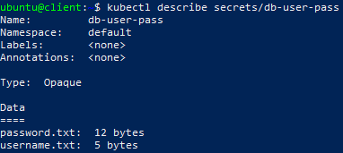

# Secrets
{: .no_toc }
---

 
 


## Table of contents
{: .no_toc .text-delta }

1. TOC
{:toc}

## What is the Secret 

**Secret** - Is an object that contains a small amount of sensitive data such as a password, a token, or a key. Such information might otherwise be put in a Pod specification or in an image; putting it in a Secret object allows for more control over how it is used, and reduces the risk of accidental exposure.Service creating

Users can create secrets, and the system also creates some secrets.

To use a secret, a pod needs to reference the secret. A secret can be used with a pod in two ways: as files in a volume mounted on one or more of its containers, or used by kubelet when pulling images for the pod.


## Secret creation

In this part we consider two ways for creating secrets:
- Creating a Secret Using `kubectl create`
- Creating a Secret from `yaml` file 

1) Creating a Secret Using "kubectl create":

Create files needed for rest of example:
 - `echo -n 'admin' > ./username.txt`
 - `echo -n '1f2d1e2e67df' > ./password.txt`

Say that some pods need to access a database. The username and password that the pods should use is in the files `./username.txt` and `./password.txt` on your local machine

Use the `kubectl create secret generic db-user-pass --from-file=./username.txt --from-file=./password.txt` command to packages these files into a Secret and creates the object on the Apiserver


Now you can check that the secret was created by command: `kubectl get secrets`


And see details of it by command: `kubectl describe secrets/db-user-pass`



2) Creating a Secret from "yaml" file: 

For example, to store two strings in a Secret using the data field, convert them to base64 as follows:

- echo -n 'admin' | base64
- echo -n 'password' | base64


Create a `yaml` file called for example `mysecret.yaml` with the following listing’s contents: 

```yaml
apiVersion: v1
kind: Secret
metadata:
  name: mysecret
type: Opaque
data:
  username: YWRtaW4=
  password: cGFzc3dvcmQ=
```   
Use `kubectl apply -f ./mysecret.yaml` command to create Secret.


Use command: `kubectl get secrets mysecret -o yaml` to see detailed information about Secret.


## Using secrets

Secrets can be mounted as data volumes or be exposed as environment variables to be used by a container in a pod:

1) Mount secret as data volume: 

Create a `yaml` file called for example `nginx.yaml` with the following listing’s contents:

```yaml
apiVersion: v1
kind: Pod
metadata:
  name: newpod
spec:
  containers:
  - name: newpod
    image: redis
    volumeMounts:
    - name: foo
      mountPath: "/etc/foo"
      readOnly: true
  volumes:
  - name: foo
    secret:
      secretName: mysecret
```
Use `kubectl create -f nginx.yaml` command to create Pod.

`pod/newpod created`

Now we have pod `newpod` with secret `mysecret` whitch is located at /etc/foo.
We can see secret detils useing this commnads:

`kubectl exec newpod -it -- /bin/sh`
<br>`ls -l /etc/foo`
<br>`cat /etc/foo/username`
<br>`cat /etc/foo/password`


We have been get values what we used and encoded earlier:
 <br> `username: YWRtaW4=`
 <br> `password: cGFzc3dvcmQ=`