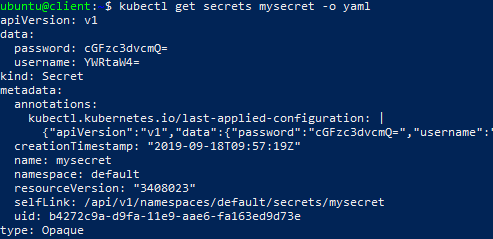

# Secrets
{: .no_toc }
---

 
 


## Table of contents
{: .no_toc .text-delta }

1. TOC
{:toc}

## What is the Secret 

**Secret** - Is an object that contains a small amount of sensitive data such as a password, a token, or a key. Such information might otherwise be put in a Pod specification or in an image; putting it in a Secret object allows for more control over how it is used, and reduces the risk of accidental exposure.

To use a secret, a pod needs to reference the secret. A secret can be used with a pod in two ways: as files in a volume mounted on one or more of its containers, or used by kubelet when pulling images for the pod.


## Create a Secret

In this part we consider two ways to create secrets:
- Create a Secret using `kubectl create`
- Create a Secret from `yaml` file 

1) Create a Secret Using "kubectl create":

Create files needed for rest of example:
 - `echo -n 'admin' > ./username.txt`
 - `echo -n '1f2d1e2e67df' > ./password.txt`

Say that some pods need to access a database. The username and password that the pods should use is in the files `./username.txt` and `./password.txt` on your local machine

Use the `kubectl create secret generic db-user-pass --from-file=./username.txt --from-file=./password.txt` command to package these files into a Secret and creates the object on the Apiserver


Now you can check that the secret was created by command: `kubectl get secrets`


And see details of it by command: `kubectl describe secrets/db-user-pass`


2) Creating a Secret from "yaml" file: 

For example, to store two strings in a Secret using the data field, convert them to base64 as follows:

- `echo -n 'admin' | base64`
- `echo -n 'password' | base64`


Create a `yaml` file called, for example, `mysecret.yaml` with the following listing’s contents: 

```yaml
apiVersion: v1
kind: Secret
metadata:
  name: mysecret
type: Opaque
data:
  username: YWRtaW4=
  password: cGFzc3dvcmQ=
```   
Use `kubectl apply -f ./mysecret.yaml` command to create Secret.


Use command: `kubectl get secrets mysecret -o yaml` to see detailed information about Secret.



## Using secrets

Secrets can be mounted as data volumes or be exposed as environment variables to be used by a container in a pod:

1) Mount secret as data volume: 

Create a `yaml` file called for example `nginx.yaml` with the following listing’s contents:

```yaml
apiVersion: v1
kind: Pod
metadata:
  name: newpod
spec:
  containers:
  - name: newpod
    image: redis
    volumeMounts:
    - name: foo
      mountPath: "/etc/foo"
      readOnly: true
  volumes:
  - name: foo
    secret:
      secretName: mysecret
```
Use `kubectl create -f nginx.yaml` command to create Pod.

`pod/newpod created`

Now we have pod `newpod` with secret `mysecret` which is located at /etc/foo.
We can see secret details using this commnads:

`kubectl exec newpod -it -- /bin/sh`
<br>`ls -l /etc/foo`
<br>`cat /etc/foo/username`
<br>`cat /etc/foo/password`


We have been get values what we used and encoded earlier:
 <br> `username: YWRtaW4=`
 <br> `password: cGFzc3dvcmQ=`

 2) Using secret as Environment Variables:

 To use a secret in an environment variable in a pod: 
  - Create a secret or use an existing one. Multiple pods can reference the same secret.
  - Modify your Pod definition in each container that you wish to consume the value of a secret key to add an environment variable for each secret key you wish to consume. The environment variable that consumes the secret key should populate the secret’s name and key in: `env[].valueFrom.secretKeyRef`
  - Modify your image and/or command line so that the program looks for values in the specified environment variables

  This is an example of a pod that uses secrets from environment variables:

```yaml
  apiVersion: v1
kind: Pod
metadata:
  name: secret-env-pod
spec:
  containers:
  - name: mycontainer
    image: redis
    env:
      - name: SECRET_USERNAME
        valueFrom:
          secretKeyRef:
            name: mysecret
            key: username
      - name: SECRET_PASSWORD
        valueFrom:
          secretKeyRef:
            name: mysecret
            key: password
  restartPolicy: Never
  ```
Now we have pod `secret-env-pod` with secret `mysecret` usiing as environment variables.
We can see secret details using this commnads:

Connect to your pod:

- `kubectl exec secret-env-pod -it -- /bin/sh` 

Display enviroment variable of Username: 

- `echo $SECRET_USERNAME` 

Display enviroment variable of Password: 

- `echo $PASSWORD`

