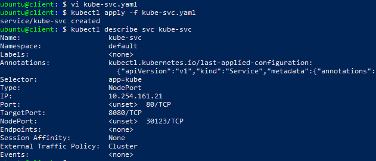

# Secrets
{: .no_toc }
---

 
 


## Table of contents
{: .no_toc .text-delta }

1. TOC
{:toc}

## What is the Secret 

**Secret** - Is an object that contains a small amount of sensitive data such as a password, a token, or a key. Such information might otherwise be put in a Pod specification or in an image; putting it in a Secret object allows for more control over how it is used, and reduces the risk of accidental exposure.Service creating

Users can create secrets, and the system also creates some secrets.

To use a secret, a pod needs to reference the secret. A secret can be used with a pod in two ways: as files in a volume mounted on one or more of its containers, or used by kubelet when pulling images for the pod.


## Secret creation


Create files needed for rest of example:
 - `echo -n 'admin' > ./username.txt`
 - `echo -n '1f2d1e2e67df' > ./password.txt`

Say that some pods need to access a database. The username and password that the pods should use is in the files `./username.txt` and `./password.txt` on your local machine

Use the `kubectl create secret generic db-user-pass --from-file=./username.txt --from-file=./password.txt` command to packages these files into a Secret and creates the object on the Apiserver


1) Create a `yaml` file called for example `kube-svc.yaml` with the following listing’s contents: 

```yaml
apiVersion: v1
kind: Service
metadata:
  name: kube-svc
spec:
  type: NodePort  
  ports:
    - port: 80
      targetPort: 8080
    selector:
      app: kube
```   
Use `kubectl create -f kube-svc.yaml` command to create NodePort Service.

2) If you already created Service you can edit it with command:
- `kubectl edit svc kube-svc`.

Make nessesary changes and saved. It will be automatically applyed to your cluster.

 

Now you can list all Service resources in your namespace and see
that an internal cluster IP has been assigned to your service. To see it use the command:
- `kubectl get scv` 


Now we can use command: `kubectl describe svc kube-svc` to see NodePort type in our Service's details.

  


