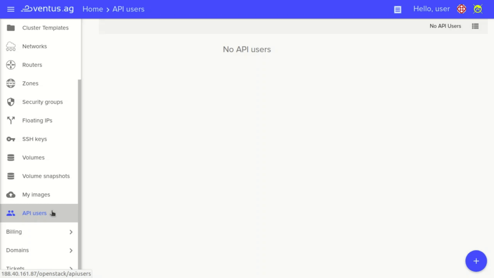

# Services
{: .no_toc }
---

In this page, you can find an explanation of how to create a new service in your Kubernetes cluster. For service creation you will need cluster and access to cli. How to do that you can find in relevant core tasks: 
 - <a href="https://ventus-ag.github.io/docs/docs/coretasks/Clusters">Clusters</a>
 - Get access to your cli 

## Table of contents
{: .no_toc .text-delta }

1. TOC
{:toc}

## What is a service?

A Kubernetes Service is a resource you create to make a single, constant point of
entry to a group of pods providing the same service. Each service has an IP address
and port that never change while the service exists. Clients can open connections to
that IP and port, and those connections are then routed to one of the pods backing
that service. This way, clients of a service don’t need to know the location of individual pods providing the service, allowing those pods to be moved around the cluster
at any time.

## Service creating

For creating new Service do following:

1) Create a `yaml` file called for example `kube-svc.yaml` with the following listing’s contents: 

```yaml
apiVersion: v1
kind: Service
metadata:
  name: kube
spec:
  ports:
    - port: 80
      targetPort: 8080
    selector:
      app: kube
```   
You’re defining a service called kube, which will accept connections on port 80 and
route each connection to port 8080 of one of the pods matching the app=kube
label selector. 

2) Create the service by posting the file using command:
- `kubectl create -f kube-svc.yaml`.

 

You you can list all Service resources in your namespace and see
that an internal cluster IP has been assigned to your service:

2) On the following page enter the user name (Eg. "User1"), password and an optional description as shown below: 
   
Once a user is created, you will be able to access OpenStack endpoints directly with your project ID, username and password.

## Delete an API User
To delete an api user, just click on the delete button in the card or list view and on the following page confirm your action as shown below:
 
 

**For example, see a quick recap**



