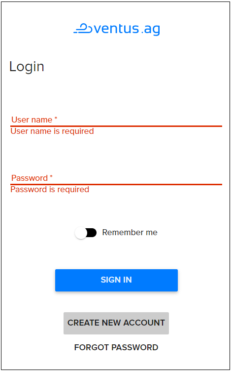
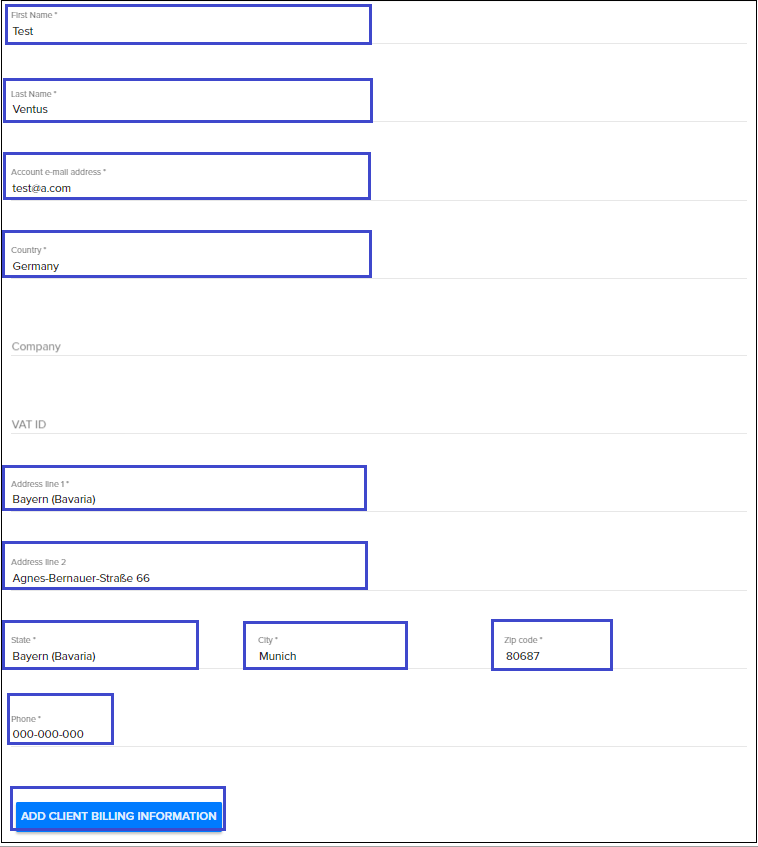
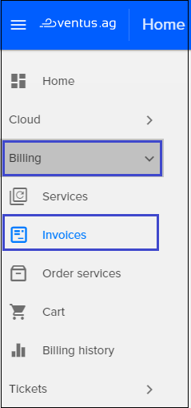
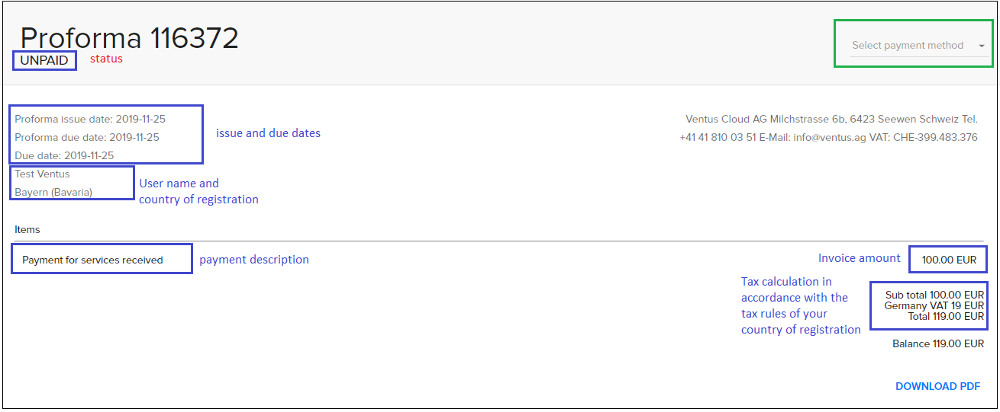
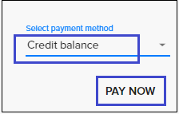
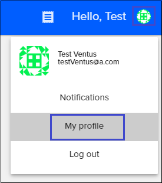
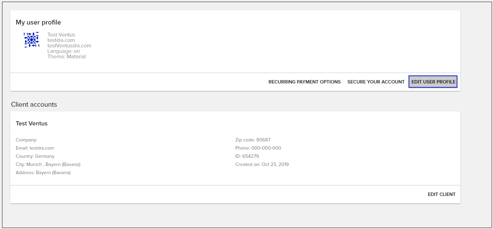
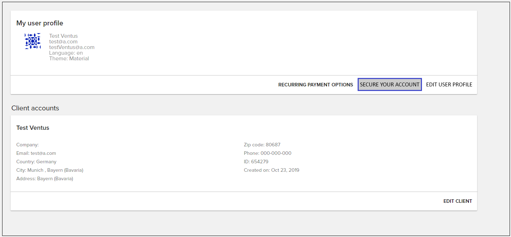
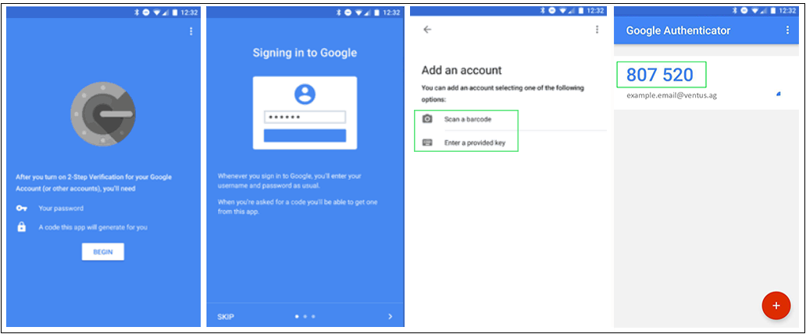
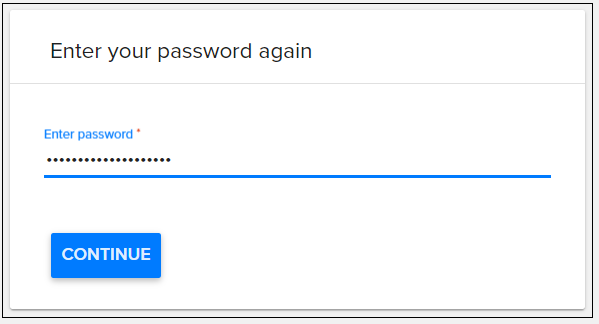

# How to create and manage a new Ventus Cloud account
{: .no_toc }
---

  

## Table of contents
{: .no_toc .text-delta }

1. TOC
{:toc}

# Create a new Ventus Cloud account
---
The Ventus portal is a browser-based user interface to create VMs and their associated resources. This quickstart shows you how to start work in Ventus portal, how to create a new user account and then sign in.

To start work in VentusCloud portal firstly you need to create a new user account. So, let's start.
Following the home page of VentusCloud  - <https://portal.ventuscloud.eu/login>, you can see the next interface:  

As you are not registered yet on VentusCloud portal you need to click to **CREATE NEW ACCOUNT**.

On the next page fill in the following form as shown below and check that you don't forget to indicate that you agree to the terms and conditions of VentusCloud portal and click the **SIGNED UP**:  

  

On the next opened page you need:
* to duplicate the information you provided on the last page, such as:   
    - First name  
    - Last name  
    - Account e-mail adress  
* and provide additional information required for registration, such as:  
    - Country  
    - Adress  
    - State  
    - City  
    - Zip Code  
    - Phone  

   

All fields that must be filled on this page are marked with an asterisk (as shown below) and if you represet **B2C** form of commercial communications this infornation will be sufficient. 

 

But if you represet **B2B** form of commercial communications you need to fill in all the specified fields, including:  `Company` and `VAT ID`: 

  

After filling in all required fields, review the information you entered for this Account. If it is correct, select **ADD CLIENT BILLING INFORMATION**. 

After that, your new account is considered as registered. So, when you will visit home page of VentusCloud for the second time, you will need to indicate only **User name** (it is equal to your email address specified during registration) and **Password**. 

# Providing billing information
----

It will be necessary to provide billing information when you pay the first invoice issued to you for using the services of Ventus Cloud.

To find all available invoices issued to you go to **Billing** on the main Navigation Panel and choose **Invoices**:  

On this page you can find all your invoices, both paid and unpaid:

To view invoice details, select the one you need and click on its icon. On the next page you can find the following information:   
* Status: paid/unpaid  
* Issue and due dates  
* Your User name in Ventus Cloud  
* Your country of registration  
* Payment description  
* Invoice amount  
* Tax calculation in accordance with the tax rules of your country of registration  

Also, here you can choose a **payment method**. You have two options:  
1) if you have a credit balance in your account, you can pay the bill with  these credit  
2) or you can pay the bill with your credit card

If you want to pay with your **credit balance** just choose this payment method and click `pay now`:    

If you want to pay by **credit card**, select the appropriate payment method, click `pay now` and on the following page you need to provide information of your credit card:  
* Card number  
* date until which the card is valid
* CVC code 

  

If the payment is successful, after a few minutes the status of your account should change to `paid`.

# Manage account 
----
To find your personal account information you need to click on the icon in the upper right corner of your home page and choose `My profile`:  

On the next page you can view your accounts details. 

If you want to make any changes to your profile information or change Password click to `EDIT USER PROFILE`, make this changes and click `SAVE`.

# Secure your account
----
If you want to make your account more secure go to `SECURE YOUR ACCOUNT`.

Use option `Google Authenticator`.

Install one your device `Google Authenticator` from Playmarket or App Store.

 
Run your application and scan **QR** or enter **Secret key**.

You will get **authentication code.** which will changes every 30 seconds.

Enter your **account password.**

Enter your **authentication code.**

Now you have dual account protection!
