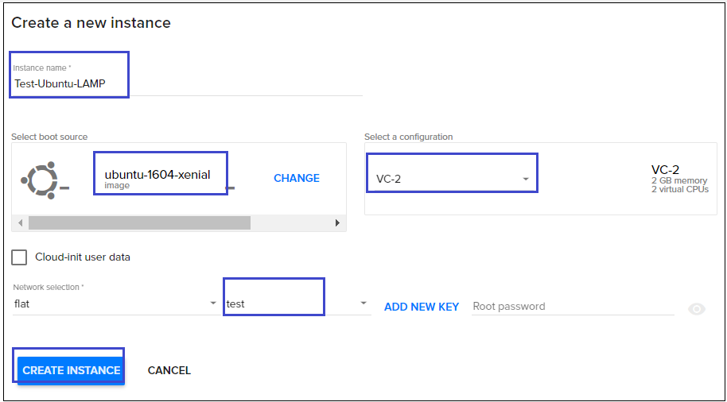
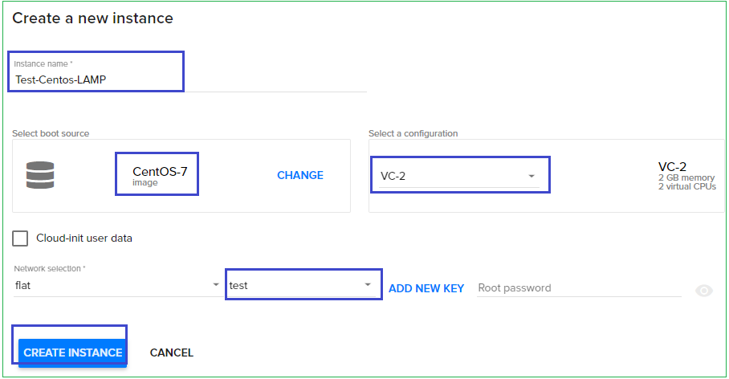
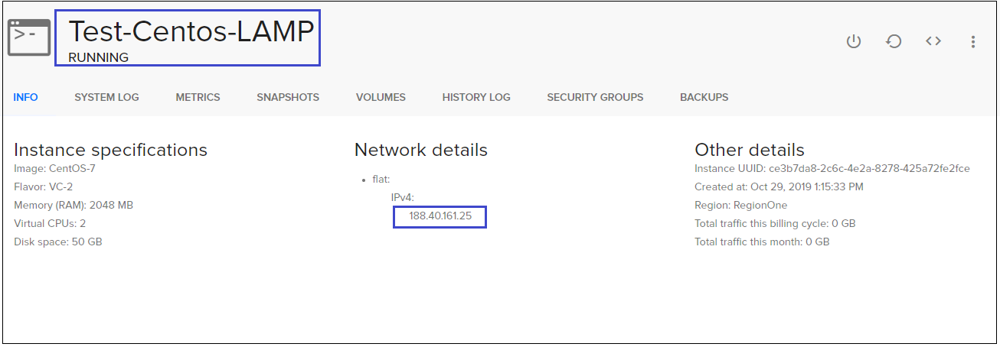
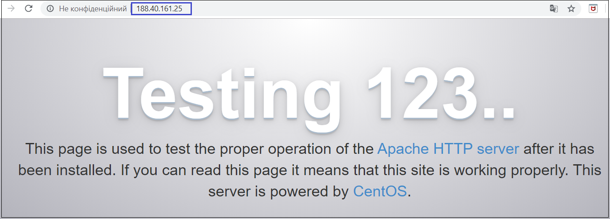
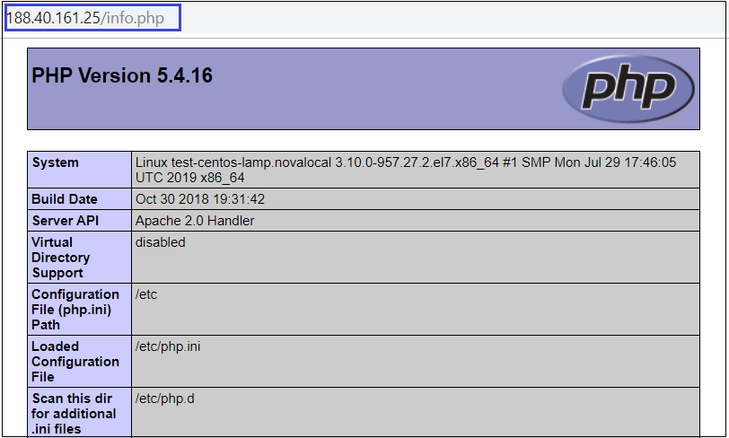
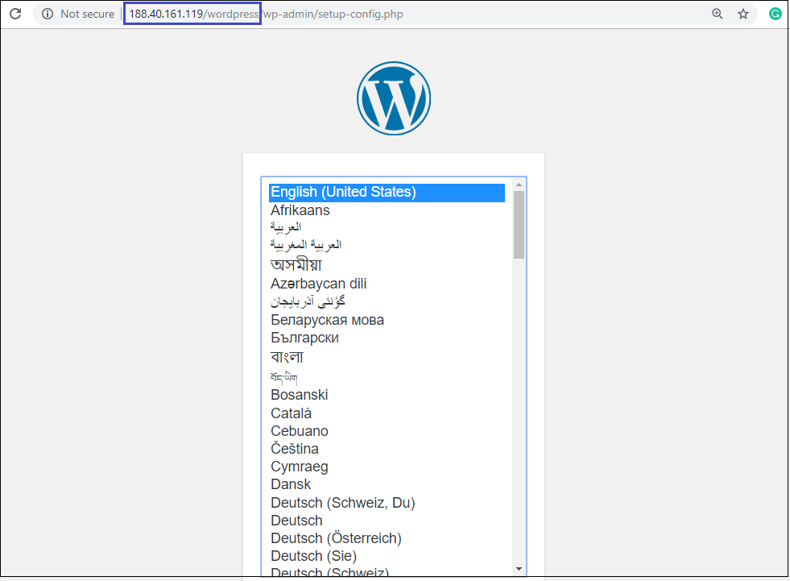
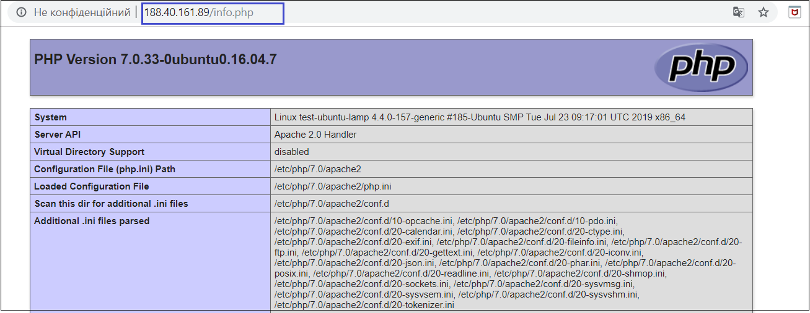
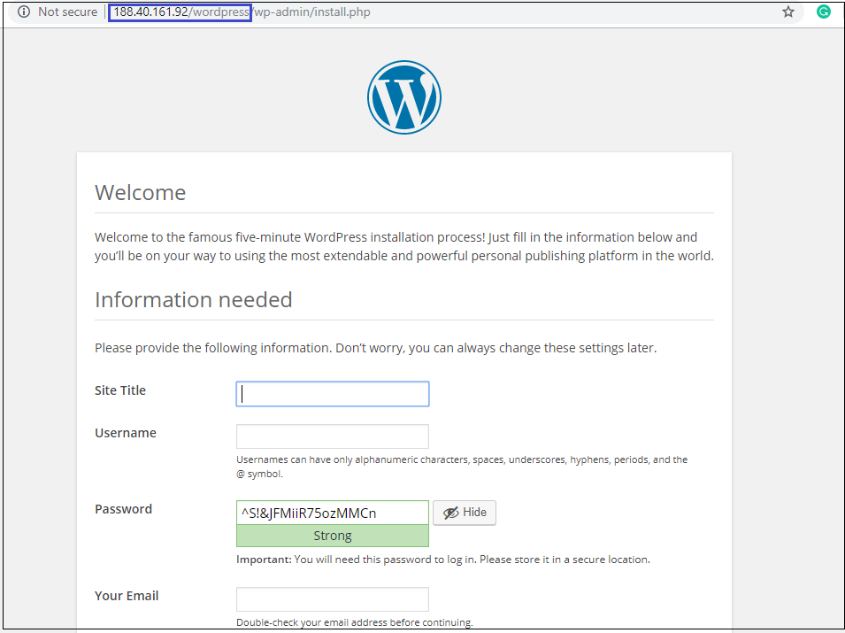

# Install a LAMP web server on a Linux virtual machine
{: .no_toc }
---

The LAMP stack is a set of open source software used for web application development. For a web application to work, it has to include an operating system, a web server, a database and, a programming language. Each layer of software is vital for creating a database-driven and dynamic website.
The name LAMP is an acronym of the following programs:
- **L**inux Operating System
- **A**pache HTTP Server
- **M**ySQL database management system
- **P**HP programming language
It is critical to install each component of the stack separately and in a specific order.

This article walks you through how to deploy an Apache web server, MySQL, and PHP (the LAMP stack) on an Ubuntu VM and an Centos VM in Ventus. To see the LAMP server in action, you can optionally install and configure a WordPress site. If you prefer the NGINX web server, see the LEMP stack tutorial. 

## Table of contents
{: .no_toc .text-delta }

* TOC
{:toc}

## Create a virtual machine
---

For creating new virtual machine do the following:

1) On the main Navigation Panel go to `Cloud`, choose `Instances` and  click the plus `+` button from at the bottom-right of the screen.  


2) On the following page fill next information:
  - Instance Name (eg. "Test_LAMP" or "Test-Centos-LAMP)
  - Select a Boot source (eg. "ubuntu-1604-xenial" or "CentOS-7")
  - Select a configuration (eg. "Small")
  - Select a SSH Key

 
or


 

3) Hit `CREATE INSTANCE` button

4) Wait untill status of your Instance will be *RUNNING*
When the VM has been created, you can view instance details. Take note of the *publicIpAddress*. This address is used to access the VM in next steps.


 


## Deploy the LAMP stack on a Centos VM
---
### Install Apache

1) Before you install the applications, make sure your CentOs 7 server is up to date by running the command below:

```
sudo yum update
```
2) We are going to use the Yum package manager to install any software applications on CentOs 7. To install Apache web server, run the command below:

```
sudo yum install httpd
```
When prompted to confirm the installation, press Y and Enter to proceed.
We are installing the software using sudo command so that we can temporarily get administrative privileges.

3) Next, we need to start Apache service by running the command below:

```
sudo systemctl start httpd.service
```
At this point, you can enter your public IP address on a browser to confirm the installation. You should get the default Apache page as shown below:

 

The page above indicates that Apache was installed successfully on your CentOs 7 server.

4) Next, you need to activate Apache to start during system boot using the command below:

```
sudo systemctl enable httpd.service
```
### Install MariaDB Database

MariaDB is a forked version of MySQL. It is an open source software application developed by a community that wants it to remain free for everyone. We will need MariaDB to store information for our dynamic websites. 

1) We can install MariaDB together with additional packages that we require on our CentOs server by running the commands below:

```
sudo yum install mariadb-server mariadb
```
2) Confirm the installation, by pressing `Y` and `Enter`.

3) Now that the MariaDB installation was completed successfully, we can run the command below to start the service.

```
sudo systemctl start mariadb
```
4) By default, our MariaDB is not secure by default, we need to remove the anonymous user and test database and configure other settings by running the command below:

```
sudo mysql_secure_installation
```
You will be prompted to enter your MariaDB root password, just press Enter because you haven’t set any password yet. Please note that this should not be confused by the root password of your server.

Once you have done this, you will be asked a series of questions. We have provided the answers below for simplicity:

```
Set root password? [Y/n] Y
New password: Enter your password here
Re-enter new password: repeat your password
Remove anonymous users? [Y/n] Y
Disallow root login remotely? [Y/n] Y
Remove test database and access to it? [Y/n] Y
Reload privilege tables now? [Y/n] Y
```
5) Your MariaDB server is now secure. Type the command below to enable it during boot:

```
sudo systemctl enable mariadb.service
```

### Install PHP

PHP is a general-purpose server-side scripting language. PHP works together with HTML to display dynamic content on your website. It also has the correct drivers for connecting to the MariaDB database management system that we have installed above.

1) We can install PHP and MySQL extension using the yum package installer by typing the command below:

```
sudo yum install php php-mysql
```
2) Confirm the installation, by pressing `Y` and `Enter`.

3) We need to restart Apache web server one more time for it to work with PHP by typing:

```
sudo systemctl restart httpd.service
```

4) Also, we need to install other php modules:

```
sudo yum install php*
```

Apache installs a default website on the directory ‘/var/www/html/’. So to test PHP on our CentOs 7 Server, we need to create a file there.

5) Create our ‘info.php’ file by typing the command below:

```
sudo vi /var/www/html/info.php
```

A blank text file should be displayed, just copy paste the content below on the page:

```
<?php 
phpinfo(); 
?>
```
Then press `Esc :wq`, and `Enter` to save the changes.

6) You need to visit the following URL on your browser to check whether PHP is working: http://ip_address/info.php

Remember to replace the ‘ip_address’ part with your CentOs 7 server’s public IP address.

If the installation was completed without a problem, you should see the below page on the browser:

 

Your LAMP stack is now complete and you can run any type of dynamic website/software application provided it works on the Apache, MariaDB and PHP environment. You might also need to install or enable additional PHP extensions and Apache modules depending on your web hosting needs.

### Download and Setup WordPress

1) Login to your mysql server using the command:

```
mysql -u root -p
```

2) Then create a database by following the commands. For this tutorial we will create a database named "orders_newdatabasename" with a user "orders_dbuser" and password of "mynewpassword".

You will have to write down this information since we will use it later on.

```
CREATE DATABASE wordpress_sample;

CREATE USER wp_user@localhost IDENTIFIED BY 'wp_password';

GRANT ALL PRIVILEGES ON wordpress_sample.* TO wp_user@localhost;

FLUSH PRIVILEGES;

exit
```

3) Let us install php-gd first, this module is used to resize images so we can create a thumbnail. Let us try to fetch the package from CentOS repository:

```
sudo yum install php-gd
```
4) After that we will need to restart our httpd server so it can recognize the newly installed module:

```
sudo service httpd restart
```

6) Let us install Wget programm:

```
sudo yum install wget
```

5) Go to your /html folder before we download the latest wordpress files. The /html folder is the public facing folder of your webserver.

```
cd /var/www/html/
```

6) Download the last version of wordpress files:

```
wget https://wordpress.org/wordpress-5.1.2.zip
```

7) Let us install unzip programm:

```
sudo yum install unzip
```

8) Unzip the wordpress files in the /var/www/html directory:

```
unzip wordpress-5.1.2.zip
```

9) We need to restart httpd web server one more time for it to work by typing:

```
systemctl restart httpd
```

10) And then we set the appropriate permissions for the html directory and files to increase wordpress security and to avoid problems with permissions later on as we configure our wordpress.

```
sudo chown -R apache:apache /var/www/html/*
```

11) Now you can complete the WordPress setup and publish on the platform. Open a browser and type in your **IP address/wordpress**. Substitute the public IP address of your VM. It should look similar to this image.




## Deploy the LAMP stack on an Ubuntu VM
---
### Install Apache, MySQL, and PHP
---

Run the following command to update Ubuntu package sources and install Apache, MySQL, and PHP. Note the caret (^) at the end of the command, which is part of the lamp-server^ package name.  

```
sudo apt update && sudo apt install lamp-server^  
```

You are prompted to install the packages and other dependencies. This process installs the minimum required PHP extensions needed to use PHP with MySQL.

### Verify Apache

Check the version of Apache with the following command:  

```
apache2 -v
```

With Apache installed, and port 80 open to your VM, the web server can now be accessed from the internet. To view the Apache2 Ubuntu Default Page, open a web browser, and enter the public IP address of the VM. Use the public IP address you used to SSH to the VM:

 

### Verify and secure MySQL

1) Check the version of MySQL with the following command (note the capital V parameter):  

```
mysql -V
```    

2) To help secure the installation of MySQL, including setting a root password, run the `mysql_secure_installation` script.

```  
sudo mysql_secure_installation
``` 

You can optionally set up the Validate Password Plugin (recommended). Then, set a password for the MySQL root user, and configure the remaining security settings for your environment. We recommend that you answer "Y" (yes) to all questions.

If you want to try MySQL features (create a MySQL database, add users, or change configuration settings), login to MySQL. This step is not required to complete this tutorial.

```  
sudo mysql -u root -p
``` 

When done, exit the mysql prompt by typing \q.

### Verify PHP

Check the version of PHP with the following command:
  
`php -v`  

If you want to test further, create a quick PHP info page to view in a browser:

1) Create a basic PHP script and save it to the “web root” directory. This is necessary for Apache to find and serve the file correctly. This directory is located at `/var/www/html/`.

To create a file in that directory, type in the following command in the terminal:
  
```  
sudo nano /var/www/html/info.php 
```

That will open the bank file.

2) Inside the file, type in the valid PHP code:

```  
<?php  
phpinfo (); 
?>  
```

3) Press `CTRL + X` to save and close the file, and press y and `ENTER` to confirm.

4) Open a browser and type in **your IP address/info.php**
The output should display the details of the LAMP stack as seen in the image below:


 


### Install WordPress
---

If you want to try your stack, install a sample app. As an example, the following steps install the open source [WordPress](https://wordpress.org/) platform to create websites and blogs. Other workloads to try include [Drupal](https://www.drupal.org/) and [Moodle](https://moodle.org/).

This WordPress setup is only for proof of concept. To install the latest WordPress in production with recommended security settings, see the [WordPress documentation](https://codex.wordpress.org/Main_Page).

1) To install the WordPress package run the following command:

```
sudo apt install wordpress    
```

2)After that you need to configure WordPress by using MySQL and PHP.

2.1) In a working directory, create a text file `wordpress.sql` to configure the MySQL database for WordPress: 

```
sudo sensible-editor wordpress.sql
```  

2.2) Add the following commands, substituting a database password of your choice for *yourPassword* (leave other values unchanged). If you previously set up a MySQL security policy to validate password strength, make sure the password meets the strength requirements. Save the file.

```  
CREATE DATABASE wordpress;  
GRANT SELECT,INSERT,UPDATE,DELETE,CREATE,DROP,ALTER  
ON wordpress.*  
TO wordpress@localhost 
IDENTIFIED BY 'yourPassword';  
```

2.3) Run the following command to create the database:  

```
cat wordpress.sql | sudo mysql --defaults-extra-file=/etc/mysql/debian.cnf  
```

2.4) Because the file `wordpress.sql` contains database credentials, delete it after use:  

```
sudo rm wordpress.sql
```

2.5) To configure PHP, run the following command to open a text editor of your choice and create the file `/etc/wordpress/config-localhost.php`:  

```
sudo sensible-editor /etc/wordpress/config-localhost.php
```  

Copy the following lines to the file, substituting your WordPress database password for *yourPassword* (leave other values unchanged). Then save the file.

```  
<?php
define('DB_NAME', 'wordpress');  
define('DB_USER', 'wordpress');  
define('DB_PASSWORD', 'yourPassword');  
define('DB_HOST', 'localhost'); 
define('WP_CONTENT_DIR', '/usr/share/wordpress/wp-content');  
?>  
```

2.6) Move the WordPress installation to the web server document root: 

```
sudo ln -s /usr/share/wordpress /var/www/html/wordpress  
sudo mv /etc/wordpress/config-localhost.php /etc/wordpress/config-default.php
``` 

2.7) Now you can complete the WordPress setup and publish on the platform. Open a browser and type in your **IP address/wordpress**. Substitute the public IP address of your VM. It should look similar to this image.

 

**Let's re-cap what we've done:**
- Create an Ubuntu VM and Centos VM
- Install Apache, MariaDB Database and PHP on a Centos VM
- Install Apache, MySQL, and PHP on an Ubuntu VM
- Verify installation and configuration 
- Install WordPress on the LAMP server 