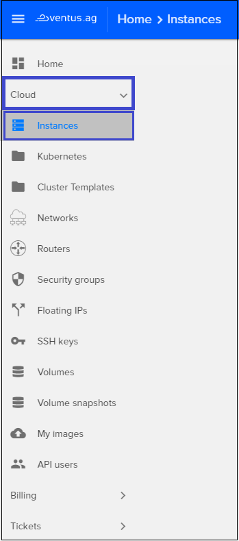
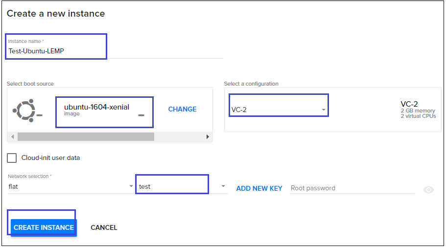
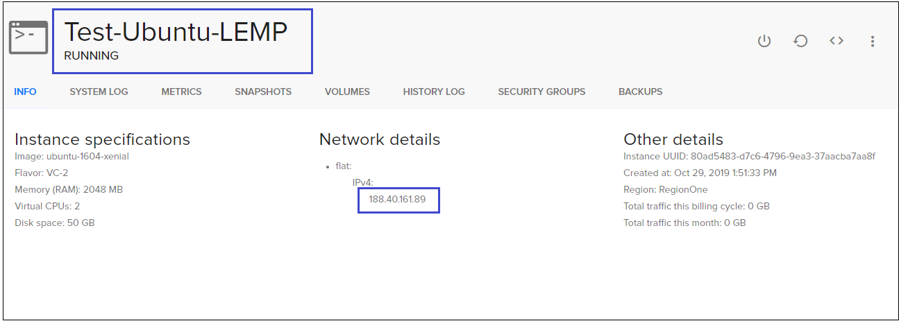
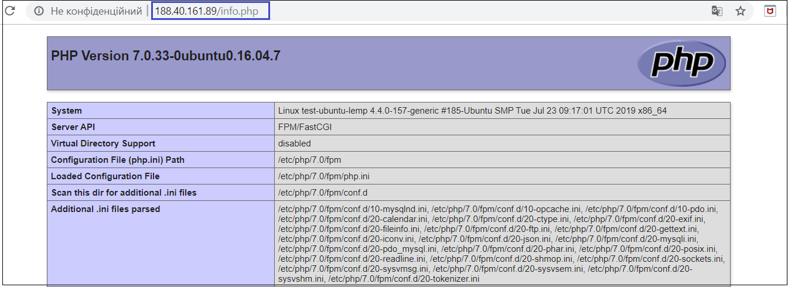
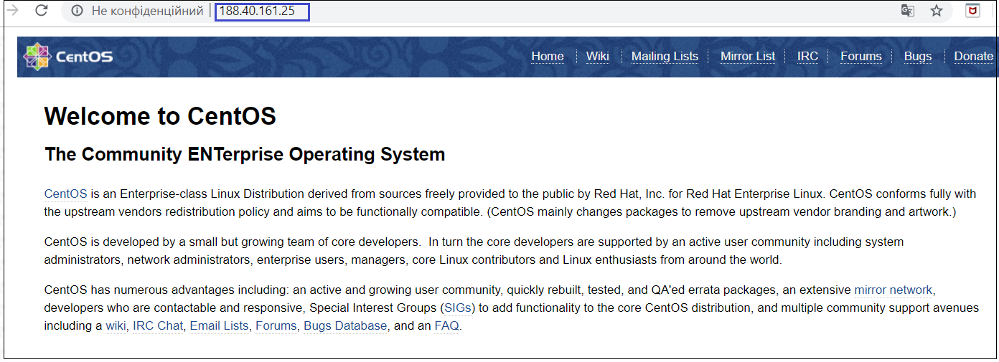
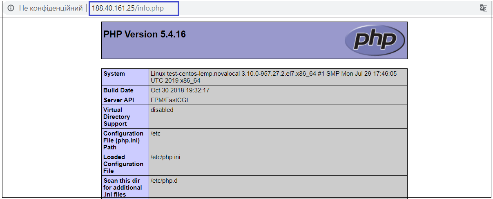

# Install a LEMP web server on a Linux virtual machine
{: .no_toc }
---

The LEMP software stack is a group of software that can be used to serve dynamic web pages and web applications. This is an acronym that describes a **L**inux operating system, with an Nginx (pronounced like “**E**ngine-X”) web server. The backend data is stored in the **M**ySQL database and the dynamic processing is handled by **P**HP.

A LEMP stack is a powerful platform that will allow you to set up and serve nearly any website or application from your server.

This article walks you through how to deploy an NGINX web server, MySQL, and PHP (the LEMP stack) on an Ubuntu VM in Ventus. 

The LEMP stack is an alternative to the popular LAMP stack, which you can also install in Ventus. To see the LEMP server in action, you can optionally install and configure a WordPress site.  


## Table of contents
{: .no_toc .text-delta }

1. TOC
{:toc}

## Create a virtual machine
---

For creating new virtual machine do the following:

1) On the main Navigation Panel go to `Cloud`, choose `Instances` and  click the plus `+` button from at the bottom-right of the screen.  




2) On the following page fill next information:
 - Instance Name (eg. "Test_LEMP" or "Test-Centos-LEMP)
 - Select a Boot source (eg. "ubuntu-1604-xenial" or "CentOS-7")
  - Select a configuration (eg. "Small")
  - Select a SSH Key

 

 

3) Hit `CREATE INSTANCE` button

4) Wait untill status of your Instance will be *RUNNING*
When the VM has been created, you can view instance details. Take note of the *publicIpAddress*. This address is used to access the VM in next steps.

  

## Deploy the LEMP stack on an Ubuntu VM
### Install NGINX, MySQL, and PHP
---

Run the following command to update Ubuntu package sources and install NGINX, MySQL, and PHP.

```
sudo apt update && sudo apt install nginx && sudo apt install mysql-server php-mysql php-fpm
```

You are prompted to install the packages and other dependencies. This process installs the minimum required PHP extensions needed to use PHP with MySQL.

### Verify NGINX

Check the version of NGINX with the following command:  

```
nginx -v
```

With NGINX installed, and port 80 open to your VM, the web server can now be accessed from the internet. To view the NGINX welcome page, open a web browser, and enter the public IP address of the VM. Use the public IP address you used to SSH to the VM:

 

### Verify and secure MySQL

Check the version of MySQL with the following command (note the capital V parameter):  

```
mysql -V   
```

To help secure the installation of MySQL, including setting a root password, run the `mysql_secure_installation` script.

```  
sudo mysql_secure_installation
```  

You can optionally set up the Validate Password Plugin (recommended). Then, set a password for the MySQL root user, and configure the remaining security settings for your environment. We recommend that you answer "Y" (yes) to all questions.

If you want to try MySQL features (create a MySQL database, add users, or change configuration settings), login to MySQL. This step is not required to complete this tutorial.

```  
sudo mysql -u root -p
```

When done, exit the mysql prompt by typing \q.

### Verify PHP

Check the version of PHP with the following command:

```  
php -v
```  

You now have all of the required LEMP stack components installed, but you still need to make a few configuration changes in order to tell Nginx to use the PHP processor for dynamic content. This is done on the server block level (server blocks are similar to Apache’s virtual hosts).

### Configuring Nginx to Use the PHP Processor

1) Open a new server block configuration file within the `/etc/nginx/sites-available/ directory`. In this example, the new server block configuration file is named *example.com*, although you can name yours whatever you’d like:   

```
sudo nano /etc/nginx/sites-available/example.com  
```

By editing a new server block configuration file, rather than editing the default one, you’ll be able to easily restore the default configuration if you ever need to.

2) Add the following content, which was taken and slightly modified from the default server block configuration file, to your new server block configuration file:   

```
server {
        listen 80;
        root /var/www/html;
        index index.php index.html index.htm index.nginx-debian.html;
        server_name _your_public_ip_;

        location / {
                try_files $uri $uri/ =404;
        }

        location ~ \.php$ {
                include snippets/fastcgi-php.conf;
                fastcgi_pass unix:/var/run/php/php7.0-fpm.sock;
        }

        location ~ /\.ht {
                deny all;
        }
}
```

Here’s what each of these directives and location blocks do:

- `listen` — Defines what port Nginx will listen on. In this case, it will listen on port 80, the default port for HTTP.  
- `root` — Defines the document root where the files served by the website are stored.  
- `index` — Configures Nginx to prioritize serving files named index.php when an index file is requested, if they’re available.  
- `server_name` — Defines which server block should be used for a given request to your server. **Point this directive to your server’s domain name or public IP address.**  
- `location /` — The first location block includes a try_files directive, which checks for the existence of files matching a URI request. If Nginx cannot find the appropriate file, it will return a 404 error.  
- `location ~ \.php$` — This location block handles the actual PHP processing by pointing Nginx to the fastcgi-php.conf configuration file and the php7.2-fpm.sock file, which declares what socket is associated with php-fpm.  
- `location ~ /\.ht` — The last location block deals with .htaccess files, which Nginx does not process. By adding the deny all directive, if any .htaccess files happen to find their way into the document root they will not be served to visitors.  

3) After adding this content press `CTRL + X` to save and close the file, and press y and `ENTER` to confirm. 

4) Enable your new server block by creating a symbolic link from your new server block configuration file (in the `/etc/nginx/sites-available/ directory`) to the `/etc/nginx/sites-enabled/` directory:

```
sudo ln -s /etc/nginx/sites-available/example.com /etc/nginx/sites-enabled/
```

5) Then, unlink the default configuration file from the `/sites-enabled/` directory:

```
sudo unlink /etc/nginx/sites-enabled/default
```

**Note**: *If you ever need to restore the default configuration, you can do so by recreating the symbolic link, like this*:

```
sudo ln -s /etc/nginx/sites-available/default /etc/nginx/sites-enabled/
```

6) Test your new configuration file for syntax errors by typing:

```
sudo nginx -t
``` 

If any errors are reported, go back and recheck your file before continuing.

7) When you are ready, reload Nginx to make the necessary changes:

```
sudo systemctl reload nginx   
```

This concludes the installation and configuration of your LEMP stack. However, it’s prudent to confirm that all of the components can communicate with one another.

### Creating a PHP File to Test Configuration

Your LEMP stack should now be completely set up. You can test it to validate that Nginx can correctly hand .php files off to the PHP processor.

1) Use your text editor to create a test PHP file called `info.php` in your document root:

```
sudo nano /var/www/html/info.php
```


2) Enter the following lines into the new file. This is valid PHP code that will return information about your server:  
  
```  
<?php  
phpinfo ();  
?>    
```

3) Press `CTRL + X` to save and close the file, and press y and `ENTER` to confirm.

4) Open a browser and type in **your IP address/info.php**
The output should display the details of the LEMP stack as seen in the image below:

 


## Deploy the LEMP stack on an Ubuntu VM
### Install Nginx

In order to display web pages to our site visitors, we are going to employ Nginx, a modern, efficient web server.

1) To add the CentOS 7 EPEL repository, open terminal and use the following command:
```
sudo yum install epel-release
```

2) Now that the Nginx repository is installed on your server, install Nginx using the following yum command:
```
sudo yum install nginx
```
Afterwards, your web server is installed.

3) Once it is installed, you can start Nginx on your VPS:
```
sudo systemctl start nginx
```
You can do a spot check right away to verify that everything went as planned by visiting your server’s public IP address in your web browser (see the note under the next heading to find out what your public IP address is if you do not have this information already): **http://server_domain_name_or_IP/**
You will see the default CentOS 7 Nginx web page, which is there for informational and testing purposes. It should look something like this:

 

If you see this page, then your web server is now correctly installed.

4) Before continuing, you will want to do is enable Nginx to start on boot. Use the following command to do so:
```
sudo systemctl enable nginx
```

### Install MySQL (MariaDB)
Now that we have our web server up and running, it is time to install MariaDB, a MySQL drop-in replacement. MariaDB is a community-developed fork of the MySQL relational database management system. Basically, it will organize and provide access to databases where our site can store information.

1) Again, we can use yum to acquire and install our software. This time, we’ll also install some other “helper” packages that will assist us in getting our components to communicate with each other:
```
sudo yum install mariadb-server mariadb
```

2) When the installation is complete, we need to start MariaDB with the following command:
```
sudo systemctl start mariadb
```
3) By default, our MariaDB is not secure by default, we need to remove the anonymous user and test database and configure other settings by running the command below:

```
sudo mysql_secure_installation
```
You will be prompted to enter your MariaDB root password, just press Enter because you haven’t set any password yet. Please note that this should not be confused by the root password of your server.

Once you have done this, you will be asked a series of questions. We have provided the answers below for simplicity:

```
Set root password? [Y/n] Y
New password: Enter your password here
Re-enter new password: repeat your password
Remove anonymous users? [Y/n] Y
Disallow root login remotely? [Y/n] Y
Remove test database and access to it? [Y/n] Y
Reload privilege tables now? [Y/n] Y
```
4) Your MariaDB server is now secure. Type the command below to enable it during boot:

```
sudo systemctl enable mariadb.service
```
At this point, your database system is now set up and we can move on.

###  Install PHP
PHP is the component of our setup that will process code to display dynamic content. It can run scripts, connect to our MySQL databases to get information, and hand the processed content over to our web server to display.

1) We can once again leverage the yum system to install our components. We’re going to include the php-mysql and php-fpm packages as well:
```
sudo yum install php php-mysql php-fpm
```
2) We now have our PHP components installed, but we need to make a slight configuration change to make our setup more secure.

2.1) Open the main php-fpm configuration file with root privileges:
```
sudo vi /etc/php.ini
```
What we are looking for in this file is the parameter that sets cgi.fix_pathinfo. This will be commented out with a semi-colon (;) and set to “1” by default.

This is an extremely insecure setting because it tells PHP to attempt to execute the closest file it can find if a PHP file does not match exactly. This basically would allow users to craft PHP requests in a way that would allow them to execute scripts that they shouldn’t be allowed to execute.

We will change both of these conditions by uncommenting the line and setting it to “0” like this:
```
cgi.fix_pathinfo=0
```
Save and close the file when you are finished.

2.2) Next, open the php-fpm configuration file www.conf:
```
sudo vi /etc/php-fpm.d/www.conf
```
Find the line that specifies the listen parameter, and change it so it looks like the following:
```
listen = /var/run/php-fpm/php-fpm.sock
```
Next, find the lines that set the listen.owner and listen.group and uncomment them. They should look like this:
```
listen.owner = nobody
listen.group = nobody
```
Lastly, find the lines that set the user and group and change their values from “apache” to “nginx”:
```
user = nginx
group = nginx
```
Then save and quit.

2.3) Now, we just need to start our PHP processor by typing:
```
sudo systemctl start php-fpm
```
This will implement the change that we made.

2.4) Next, enable php-fpm to start on boot:
```
sudo systemctl enable php-fpm
```
### Configure Nginx to Process PHP Pages

Now, we have all of the required components installed. The only configuration change we still need to do is tell Nginx to use our PHP processor for dynamic content.

1) We do this on the server block level (server blocks are similar to Apache’s virtual hosts). Open the default Nginx server block configuration file by typing:
```
sudo vi /etc/nginx/conf.d/default.conf
```
We need to make some changes to this file for our site.

- First, we need to add an index.php option as the first value of our index directive to allow PHP index files to be served when a directory is requested.
- We also need to modify the server_name directive to point to our server’s domain name or public IP address
- The actual configuration file includes some commented out lines that define error processing routines. We will uncomment those to include that functionality.
- For the actual PHP processing, we will need to uncomment a portion of another section. We will also need to add a try_files directive to make sure Nginx doesn’t pass bad requests to our PHP processor.

The changes that you need to make are in red in the text below. If you prefer, you may just copy and paste everything, then replace the value of server_name with the appropriate domain name or IP address:
```
server {
    listen       80;
    server_name  server_domain_name_or_IP;

    # note that these lines are originally from the "location /" block
    root   /usr/share/nginx/html;
    index index.php index.html index.htm;

    location / {
        try_files $uri $uri/ =404;
    }
    error_page 404 /404.html;
    error_page 500 502 503 504 /50x.html;
    location = /50x.html {
        root /usr/share/nginx/html;
    }

    location ~ \.php$ {
        try_files $uri =404;
        fastcgi_pass unix:/var/run/php-fpm/php-fpm.sock;
        fastcgi_index index.php;
        fastcgi_param SCRIPT_FILENAME $document_root$fastcgi_script_name;
        include fastcgi_params;
    }
}
```
When you’ve made the above changes, you can save and close the file.

2) Restart Nginx to make the necessary changes:
```
sudo systemctl restart nginx
```
### Test PHP Processing on your Web Server

In order to test that our system is configured properly for PHP, we can create a very basic PHP script.

We will call this script info.php. In order for Apache to find the file and serve it correctly, it must be saved to a very specific directory, which is called the “web root”.

In CentOS 7, this directory is located at /usr/share/nginx/html/. We can create the file at that location by typing:
```
sudo vi /usr/share/nginx/html/info.php
```
This will open a blank file. We want to put the following text, which is valid PHP code, inside the file:
```  
<?php  
phpinfo (); 
?>  
```

Press `CTRL + X` to save and close the file, and press y and `ENTER` to confirm.

Now we can test whether our web server can correctly display content generated by a PHP script. To try this out, we just have to visit this page in our web browser. You’ll need your server’s public IP address again.

The address you want to visit will be: **http://your_server_IP_address/info.php**

The page that you come to should look something like this:



This page basically gives you information about your server from the perspective of PHP. It is useful for debugging and to ensure that your settings are being applied correctly.

If this was successful, then your PHP is working as expected.

You probably want to remove this file after this test because it could actually give information about your server to unauthorized users. To do this, you can type this: 
```
sudo rm /usr/share/nginx/html/info.php
```
You can always recreate this page if you need to access the information again later.

## Conclusion
Now that you have a LEMP stack installed, you have many choices for what to do next. Basically, you’ve installed a platform that will allow you to install most kinds of websites and web software on your server.

**Let's re-cap what we've done:**
- Create an Ubuntu VM
- Install NGINX, MySQL, and PHP
- Verify installation and configuration
- Install WordPress on the LEMP server
