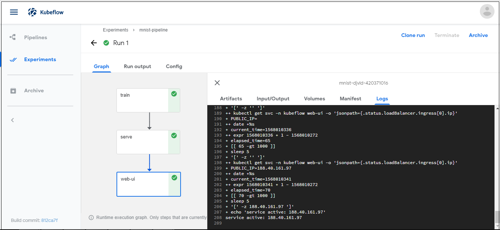

# Deploing kubeflow using kubernetes
{: .no_toc }
---





## Table of contents
{: .no_toc .text-delta }

1. TOC
{:toc}

## Create new Kubernetes cluster
---

1) Create new cluster with using tutorial: **Core Tasks/Clusters**

2) Wait until status of your cluster will be **Create completed**


## Get access to your cluster using cli
---

To get access to your cluster you need **openstack** cli tool installed and connected to your project.

1) Install openstack cli tool by running two next commands one by one. First will install openstack and second one will install magnum client which is used to operate with kubenetes clusters:

`sudo pip install python-openstackclient`<br />
`sudo pip install python-magnumclient`

2) Get OpenRC file to connect to Ventus Cloud using cli:
  - On the main Navigation Panel go to **Cloud**, choose **API users** and click the plus (+) button at the bottom-right of the screen.
  - Fill out all fields and hit **ADD API USER**
  - For new user hit **Get OpenRC file** action

  <br />

  - Select region and hit **GET FILE**

  <br />
  

  - File named "openrc" will be downloaded to your machine

3) Execute "openrc" file starting with dot:
<br />`. openrc`

4) Provide your password and hit enter - this will authenticate you in the Ventus Cloud using created API user.

5) Run next command to get a list of all clusters:
<br />`openstack coe cluster list`

6) Run next command to get kubeconfig for your cluster (tekton is the name of my cluster):
<br />`openstack coe cluster config kubeflow`

7) Export path to created config for as KUBECONFIG env variable:
<br />`export KUBECONFIG=/home/ubuntu/config`

8) Run next command to test that you have access to the cluster and all pods are running:
<br />`kubectl get pods --all-namespaces`


## Deploy Kubeflow
---

Follow these steps to deploy Kubeflow:

1) Download and install `kfctl` release from the <a href ="https://github.com/kubeflow/kubeflow/releases/">Kubeflow releases page</a> or you can run this scripts: 
- `wget https://github.com/kubeflow/kubeflow/releases/download/v0.6.2/kfctl_v0.6.2_linux.tar.gz`
- `tar -xvf kfctl_<release tag>_<platform>.tar.gz`
- `sudo cp kfctl /usr/bin/`

2) Run the following commands to set up and deploy Kubeflow. The code below includes an optional command to add the binary `kfctl` to your path. If you don’t add the binary to your path, you must use the full path to the `kfctl` binary each time you run it.



- Create kubeflow-anonymous namespace 
  - `kubectl create ns kubeflow-anonymous`

- Add `kfctl` to PATH, to make the kfctl binary easier to use.
  - `export KFAPP="kubeflow-tutorial"`
  - `export CONFIG="https://raw.githubusercontent.com/kubeflow/kubeflow/v0.6-branch/bootstrap/config/   kfctl_existing_arrikto.0.6.2.yaml"`

- Specify credentials for the default user.
  - `export KUBEFLOW_USER_EMAIL="admin@kubeflow.org"`
  - `export KUBEFLOW_PASSWORD="12341234"`

- Initialize and apply new kubeflow application to your cluster:
  - Initialize new kubeflow application:
<br />    `kfctl init ${KFAPP} --config=${CONFIG} -V`
  - Go to new folder which will be created
<br />    `cd ${KFAPP}`
  - Generate kubernetes manifests of the kubeflow application:
<br />    `kfctl generate all -V`
  - Apply new manifests to the kubernetes cluster:
<br />    `kfctl apply all -V`

3) Run next command to test that you have access to the cluster and all pods are running:
<br />`kubectl get pods --all-namespaces`


## Accsessing Kubeflow
---
**Log in as a static user**
After deploying Kubeflow, the Kubeflow dashboard is available at the Istio Gateway IP. To get the Istio Gateway IP, run:
  - `kubectl get svc -n istio-system istio-ingressgateway -o jsonpath='{.status.loadBalancer.ingress[0].ip}'`

Get the IP and open it in a browser: `https://<LoadBalancerIP address>/.`

Enter the credentials you specified in `KUBEFLOW_USER_EMAIL`, `KUBEFLOW_PASSWORD` and access the Kubeflow dashboard!  

## Compilation of a mnist pipelines
---



Run next commnads to config pipelines into kubeflow:

  - `git clone https://github.com/ventus-ag/kubeflow.git`
  - `cd kubeflow/samples/mnist-pipelines/deploy-servic`
  - `docker build -t ACCOUNT/NAME .`
  - `docker push ACCOUNT/NAME`
  - `cd ..`
  - `pip3 install -r requirements.txt --upgrade`
  - `python3 mnist_pipeline.py`

As result, you must got file `mnist_pipeline.py.tar.gz` in your folder


## Upload through the UI

Now that you have the compiled pipelines file, you can upload it through the Kubeflow Pipelines UI. Simply select the **"Upload pipeline"** button


Upload your file and give it a name


**Run the Pipeline**

After clicking on the newly created pipeline, you should be presented with an overview of the pipeline graph. When you're ready, select the "Create Run" button to launch the pipeline


Fill out the information required for the run, and press "Start" when you are ready.
 - The `model-export-dir` field must be `/mnt/export`
 - For `pvc-name` field you must create new yaml file called `pvc.yaml` with such lines:

```yaml
apiVersion: v1
kind: PersistentVolumeClaim
metadata:
  finalizers:
  - kubernetes.io/pvc-protection
  name: local-storage
  namespace: kubeflow
spec:
  accessModes:
  - ReadWriteOnce
  resources:
    requests:
      storage: 10Gi
  storageClassName: cinder |
``` 
Specify name from file you created into `pvc-name` filed.


After clicking on the newly created Run, you should see the pipeline run through the 'train', 'serve', and 'web-ui' components. Click on any component to see its logs. When the pipeline is complete, look at the logs for the web-ui component to find the IP address created for the MNIST web interface



Use IP you received in previous step and open web UI page with experiment's result:


